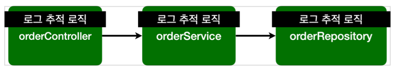

# AOP
어플리케이션 로직은 핵심 기능(비즈니스 로직)과 부가 기능(로그추적, 트랜잭션 기능)으로 나뉘어짐

모든 메서드에 단순히 하나 하나 부가 기능을 추가하려면 아주 많은 반복이 발생하여 비효율적임 

따라서 부가기능을 따로 분리하여 한곳에서 관리하도록 하고 부가기능을 어디에 적용할지 선택하는 기능(Aspect)을 만듬

Aspect :  관점이라는 뜻으로 어플리케이션을 바라보는 관점을 하나하나의 기능에서 여러 클래스에 동일하게 
사용되는 부가기능 으로 달리 보는것(아래 그림 예시)

이렇게 Aspect를 사용한 프로그래밍을 AOP(Aspect-Oriented-Programming) 즉 관점지향 프로그래밍 이라고 한다.

## AOP 적용 방식 3가지
### 컴파일 시점
AspectJ가 제공하는 특별한 컴파일러를 사용해야하며 .java 소스코드를 컴파일러를 사용하여 .class를 만드는 시점에 부가기능 로직을 추가할 수 있음
특별한 컴파일러가 필요하고 복잡함
### 클래드 로딩 시점
.class파일을 JVM에 저장하기 전에 조작할 수 있음 자바를 실행할 때 특별한 옵션을 통해 클래드 로더 조작기를
지정해야 하므로 운영하기 어려움

### ✔런타임시점 
스프링 AOP가 사용하는 방식. 컴파일이 끝나고 자바의 메인메서드가 실행된 다음 적용되어 제일 간편한 방법
자바를 실행할때 복잡한 옵션과 클래스 로더 조작기를 설정하지 않아도 되어 간편

## AOP 용어 정리
### 어드바이스(Advice)
부가 기능, 특정 조인 포인트에서 Aspect에 의해 취해지는 조치
### 조인 포인트(Join point)
어드바이스가 적용될 수 있는 위치, 스프링 AOP는 프록시 방식을 사용하므로 조인 포인트는 항상 메소드 실행 지점으로 제한됨
### 포인트 컷(Pointcut)
조인 포인트 중에서 어드바이스가 적용될 위치를 선별하는 기능
스프링 AOP는 메서드 실행 지점만 포인트컷으로 선별 가능 
### 어드바이저(Advisor)
하나의 어드바이스와 하나의 포인트컷이 더해진 것
### 애스펙트(Aspect)
어드바이스 + 포인트컷을 모듈화 한 것, 여러 어드바이스와 포인트컷이 함께 존재
### 타겟(Target)
어드바이스를 받는 객체, 포인트컷으로 결정

## Advice 종류
### @Around
메서드 호출 전후에 수행, 가장 강력한 어드바이스, ProceedingJoinPoint.proceed()를 호출해야 다음 대상이 호출된다 
리턴값이 필요할때는 ProceedingJoinPoint.proceed()를 리턴까지 해줘야함 작성자는 proceed()는 호출했지만 
리턴을 해주지 않아 NullPointException이 발생하였음
### @Before
조인 포인트 실행 이전에 실행
### @AfterReturning
조인 포인트가 정상 완료후 실행
### @AfterThrowing
메서드가 예외를 던지는 경우 실행
### @After
조인 포인트 정상/예외 상관없이 완료 후 실행

### 이해를 돕기 위한 코드
    @Around("execution(* *(..))") //이자리에 @Before, @AfterReturning, ...
    public Object doTransaction(ProceedingJoinPoint joinPoint) throws Throwable {
        try {
            //@Before
            Object result = joinPoint.proceed();
            //@AfterReturning
            return result;
        } catch (Exception e) {
            //@AfterThrowing
            throw e;
        } finally {
            //@After
        }
    }

#### 출처
인프런 김영한님 강의 : 스프링 핵심원리 - 고급편
