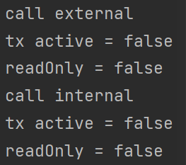
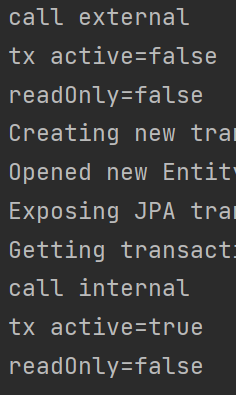

# 트랜잭션 AOP 주의사항 

@Transactional은 스프링의 트랜잭션 AOP가 적용  

트랜잭션 AOP는 기본적으로 프록시 방식의 AOP를 사용  

따라서 트랜잭션을 적용하기 위해 프록시객체가 트랜잭션 안에서 실제 객체를 호출  

## 프록시 객체 코드 예시

    @Override
    public void logic() {
        TransactionStatus status = transactionManager
            .getTransaction(new DefaultTransactionDefinition());
        try {
            super.logic();
            transactionManager.commit(status);
        } catch (Exception e) {
            transactionManager.rollback(status);
        }
    }

AOP를 적용하면 스프링은 대상 객체 대신에 프록시객체를 스프링 빈으로 등록  

따라서 스프링은 DI가 일어날때 항상 프록시 객체를 주입  

프록시 객체가 주입되기 때문에 대상 객체를 직접 호출하는 문제는 발생하지 않음  

### 트랜잭션이 없는 대상 객체의 내부에서 트랜잭션이 적용된 대상 객체의 메소드 호출이 발생할때 호출한 메소드가 트랜잭션이 적용되지 않는 문제가 발생한다.

## 예제 테스트 코드

    @Autowired
    CallService callService;

    @Slf4j
    static class CallService {

        public void external() {
            log.info("call external");
            printTxInfo();
            internal(); //내부 메소드 호출
        }

        @Transactional
        public void internal() {
            log.info("call internal");
            printTxInfo();
        }

        private void printTxInfo() {
            boolean txActive = TransactionSynchronizationManager.isActualTransactionActive();
            log.info("tx active = {}", txActive);
            boolean readOnly = TransactionSynchronizationManager.isCurrentTransactionReadOnly();
            log.info("readOnly = {}", readOnly);
        }
    }

    @Test
    void externalCall() {
        callService.external();
    }

### externalCall 테스트 실행 결과

### 문제 원인
자바는 메소드 앞에 참조가 없으면 this 키워드를 이용해 자기 자신을 가리킨다.  
따라서 프록시가 호출한 실제 객체의 external() 메소드 내부에서 호출하는 internal() 은 this 키워드가 적용되어  
프록시가 아닌 실제 객체의 internal() 메소드를 호출하기 때문에 트랜잭션이 적용되지 않는다.

### 해결 방법
메소드를 별도의 클래스로 분리하여 프록시를 호출하도록 만듬

    @Autowired
    CallService callService;

    @Test
    void externalCallV2() {
        callService.external();
    }

    static class InternalService {

        @Transactional
        public void internal() {
            log.info("call internal");
            printTxInfo();
        }

        private void printTxInfo() {
            boolean txActive = TransactionSynchronizationManager.isActualTransactionActive();
            log.info("tx active={}", txActive);
            boolean readOnly = TransactionSynchronizationManager.isCurrentTransactionReadOnly();
            log.info("readOnly={}", readOnly);
        }
    }

    static class CallService {

        private final InternalService internalService;

        public void external() {
            log.info("call external");
            printTxInfo();
            internalService.internal(); //분리된 클래스의 메소드 호출
        }

        private void printTxInfo() {
            boolean txActive = TransactionSynchronizationManager.isActualTransactionActive();
            log.info("tx active={}", txActive);
            boolean readOnly = TransactionSynchronizationManager.isCurrentTransactionReadOnly();
            log.info("readOnly={}", readOnly);
        }
    }
### 테스트 실행 결과
  
메소드를 별도의 클래스로 분리하였을때 internal의 트랜잭션이 잘 적용되었다.

#### 출처
인프런 김영한님 강의 : 스프링 DB 2편
